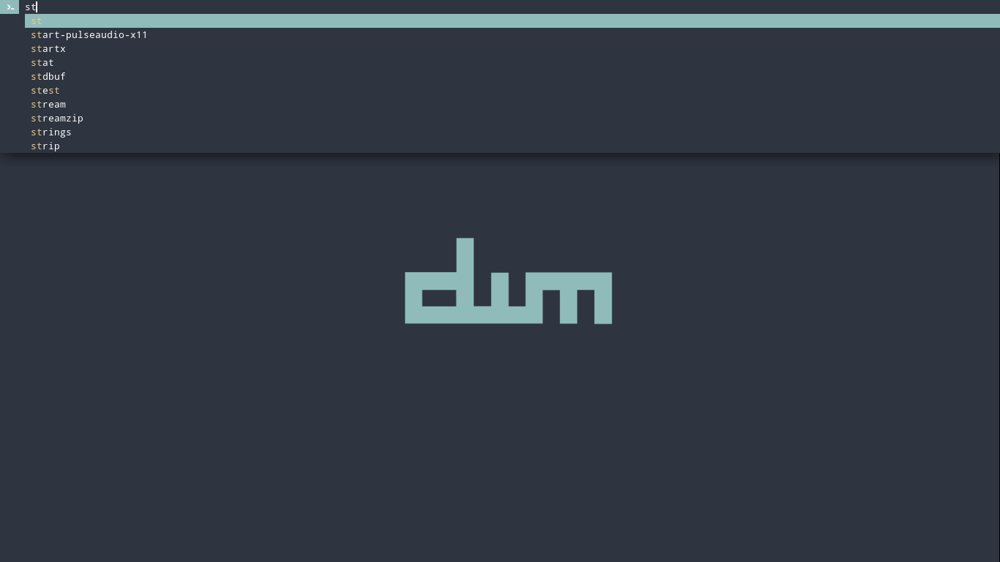

# Dynamic Menu

Fork of Suckless' [dmenu] with [Nord][nord] color scheme and applied patches.

## Patches

- [highlight]: Highlights individual characters of matched text.
- [symbols]: Allows custom previous and next indicator symbols.
- [scroll]: Support for long input text scrolling.
- [mouse-support]: Supports basic mouse actions.

## Installation

- `sudo make install`: To build and install.
- `sudo make uninstall`: To remove installed files.
- `man dmenu`: To see the manual help text.

> **Note:** Use [makepkg] for Arch-based distros.

## Dependencies

Debian-based build dependencies:

- libx11-dev: X11 client-side library.
- libxinerama-dev: X11 Xinerama extension library.
- libxft-dev: FreeType-based font drawing library for X.
- libfreetype6-dev: FreeType2 font rasterization library.

Additional runtime dependencies:

- [droid-sans-mono]: Default text font.
- [material-design-icons]: Default icon font.

[dmenu]: https://tools.suckless.org/dmenu
[nord]: https://www.nordtheme.com
[highlight]: https://tools.suckless.org/dmenu/patches/highlight
[symbols]: https://tools.suckless.org/dmenu/patches/symbols
[scroll]: https://tools.suckless.org/dmenu/patches/scroll
[mouse-support]: https://tools.suckless.org/dmenu/patches/mouse-support
[makepkg]: https://wiki.archlinux.org/index.php/makepkg
[droid-sans-mono]: https://www.droidfonts.com
[material-design-icons]: https://materialdesignicons.com
